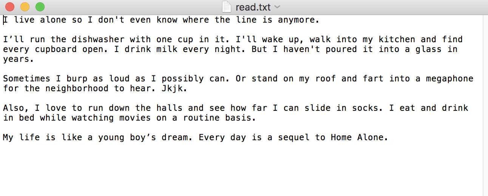
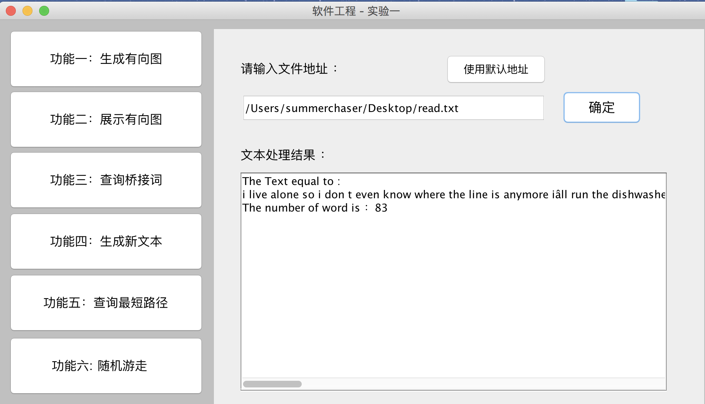
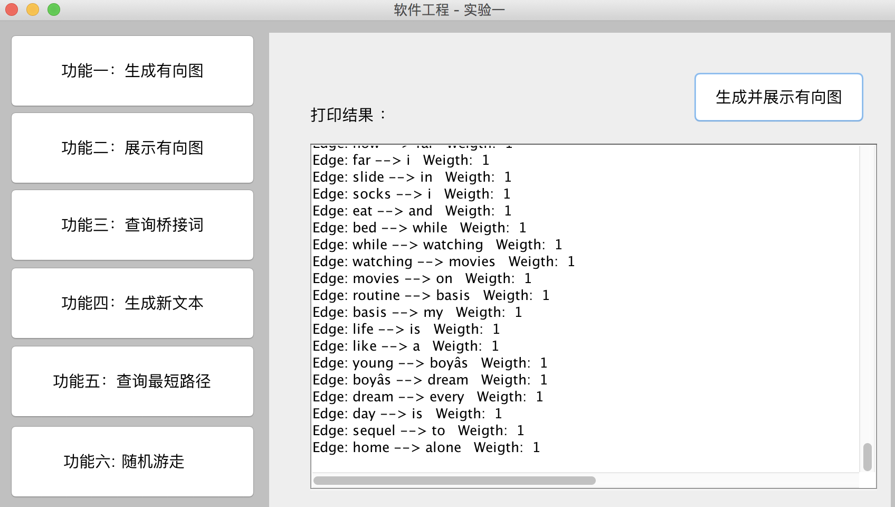
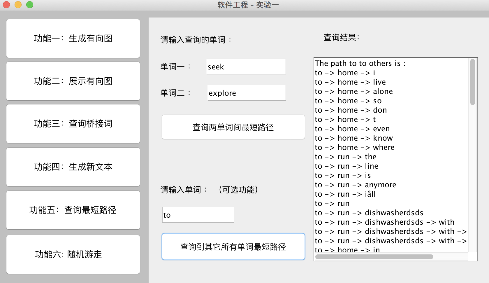
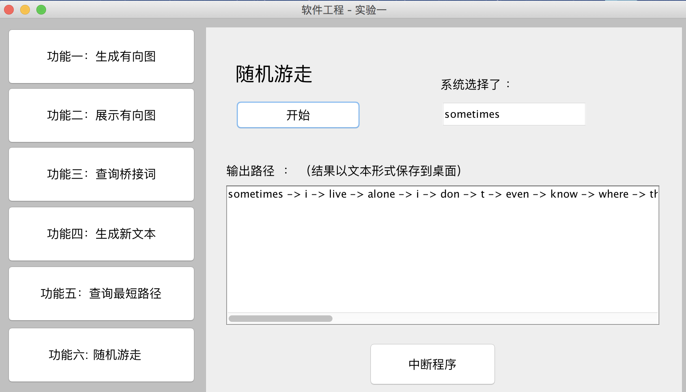

## 软件工程 Lab1

         用Swing写的GUI 生成有向图的插件是graphwiz

功能：
- [x] 功能需求1：读入文本并生成有向图
- [x] 功能需求2：展示有向图 （可选功能：将生成的有向图以图形文件形式保存到磁盘。）
- [x] 功能需求3：查询桥接词（bridge words）
- [x] 功能需求4：根据bridge word生成新文本
- [x] 功能需求5：计算两个单词之间的最短路径
- [x] 功能需求6：随机游走
 
效果图
--------------------------------

